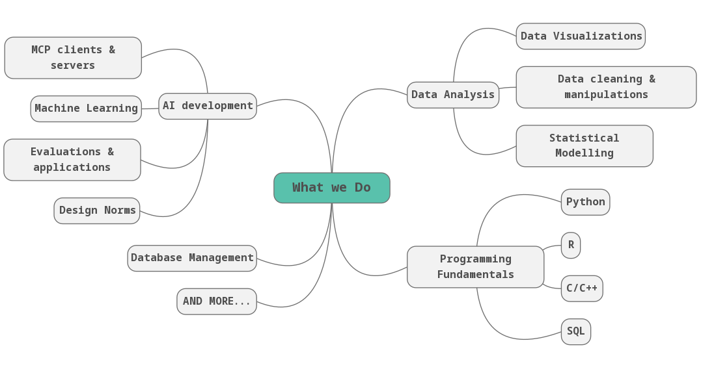

```{=html}
<script>
document.body.classList.add('about-page');
</script>
```

::: {.custom-sidebar}
::: {.sidebar-logo}

:::

::: {.sidebar-nav}
[Home](index.qmd)
[About](about.qmd)
[Subscribe](subscribe.qmd)
[Branding](branding.qmd)
:::

::: {.sidebar-social}
[LinkedIn](https://www.linkedin.com/in/jx-chen/){target="_blank"}
[GitHub](https://github.com/Cpril){target="_blank"}
:::
:::

::: {.main-content-wrapper}


::: {.branding-content}

## About ARS {.section-title}

::: {.text-body}
**ARS** comes from Latin, meaning skills, methods, and science. It captures the multiple facets that make up Data Science.

We are a platform dedicated to making data science and technologies approachable, engaging, transparent, and human-centered. Through informational blogs, hands-on projects, and creative explorations, we aim to demystify the world of data and empower learners at every stage of their journey.
:::

## Our Mission {.section-title}

::: {.three-column}
::: {.content-block}
### Make Data Accessible {.text-h3}

::: {.text-body}
We believe data science is not just for experts. Our content breaks down complex concepts into digestible, engaging pieces that anyone can understand and apply, regardless of their technical background.
:::
:::

::: {.content-block}
### Inspire Creativity {.text-h3}

::: {.text-body}
Data science is as much an art as it is a science. We showcase creative projects, innovative visualizations, and storytelling techniques that demonstrate the beauty and power of working with data.
:::
:::

::: {.content-block}
### Promote Ethics {.text-h3}

::: {.text-body}
With great power comes great responsibility. We discuss the ethical implications of data science, privacy concerns, and the importance of using technology to benefit humanity.
:::
:::
:::

## What We Cover {.section-title}

::: {.two-column}
::: {.content-block}
::: {.image-block}

:::
:::

::: {.content-block}
### Technical Skills {.text-h2}

::: {.text-body}
From Python and R programming to machine learning algorithms and data visualization techniques, we provide tutorials, code examples, and best practices to help you build your technical toolkit.

**Topics include:**

- Programming fundamentals
- Data manipulation and analysis
- Statistical modeling
- Machine learning
- Data visualization
- Web scraping and APIs
:::
:::
:::

::: {.two-column}
::: {.content-block}
### Creative Projects {.text-h2}

::: {.text-body}
Learning by doing is at the heart of data science. We share fun, practical projects that let you apply your skills, experiment with new tools, and build a portfolio that stands out.

**Project types:**

- Interactive dashboards
- Data storytelling
- Predictive models
- Web applications
- Data art and visualization
- Real-world case studies
:::
:::

::: {.content-block}
::: {.image-block}

:::
:::
:::

## Who We Are {.section-title}

::: {.horizontal-card}
::: {.image-block}

:::

::: {.text-content}
### The Team {.text-h2}

::: {.text-body}
ARS is created and maintained by a passionate team of data scientists, educators, and creative technologists who believe in the transformative power of data literacy.

We come from diverse backgrounds—statistics, computer science, design, and journalism—united by our love for making complex ideas accessible and our commitment to ethical, human-centered technology.
:::
:::
:::

## Our Values {.section-title}

::: {.three-column}
::: {.content-block}
### Clarity & Creativity {.text-h3}

::: {.text-body}
We strive for clear communication while embracing creative approaches to problem-solving and presentation.
:::
:::

::: {.content-block}
### Playfulness & Professionalism {.text-h3}

::: {.text-body}
We maintain high standards and rigor while keeping learning fun, engaging, and enjoyable.
:::
:::

::: {.content-block}
### Confidence & Humility {.text-h3}

::: {.text-body}
We share our knowledge confidently while staying open to new ideas, feedback, and continuous learning.
:::
:::
:::

## Join Our Community {.section-title}

::: {.text-body}
Whether you're just starting your data science journey or looking to sharpen your skills, there's a place for you at ARS. Subscribe to our newsletter for weekly insights, project ideas, and the latest in data science.

Ready to dive in? [Subscribe here](subscribe.qmd) and let's explore the art and science of data together.
:::

::: {.horizontal-card}
::: {.text-content}
### Stay Connected {.text-h2}

::: {.text-body}
Follow us on social media for daily tips, project showcases, and community discussions:

- **LinkedIn:** Professional insights and career tips

- **GitHub:** Access our open-source projects and code

- **Instagram:** data science quick tips and news

:::
:::

:::

:::

:::