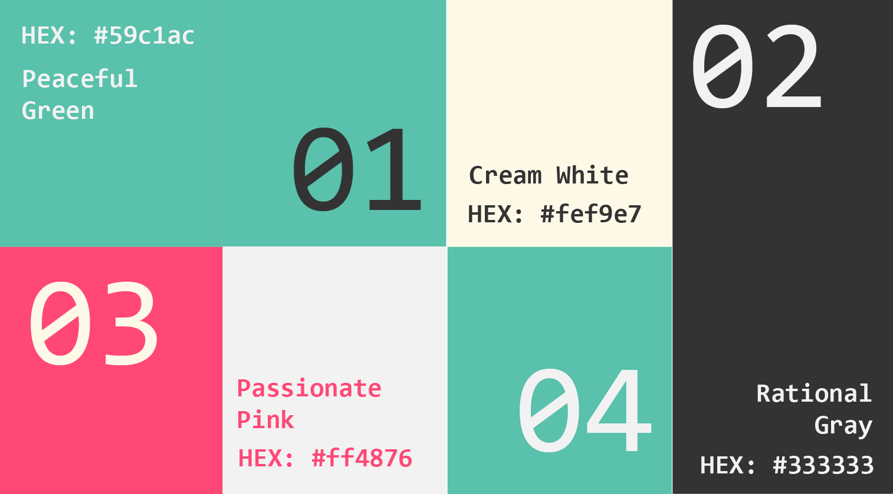

```{=html}
<script>
document.body.classList.add('branding-page');
</script>
```

::: {.custom-sidebar}
::: {.sidebar-logo}

:::

::: {.sidebar-nav}
[Home](index.qmd)
[About](about.qmd)
[Subscribe](subscribe.qmd)
[Branding](branding.qmd)
:::

::: {.sidebar-social}
[LinkedIn](https://linkedin.com/in/yourprofile){target="_blank"}
[GitHub](https://github.com/yourusername){target="_blank"}
:::
:::

::: {.main-content-wrapper}
::: {.hero-banner}

:::

::: {.branding-content}
## Brand Statement {.section-title}

::: {.text-body}
**ARS** aims to make data science and technologies approachable, engaging, transparent, and human-centered. By sharing content from technical programming to storytelling with data, we want to engage with audiance from various stage of the journey, showcase the power of data, and discuss the ethics of harvesting this power.

We emphasize that data science is not just for experts but a creative tool anyone can explore and enjoy. It also shapes the future of communication, learning, and everyday life.
:::

## Color Palette {.section-title}

::: {.one-column}



:::

## The Design Process {.section-title}

::: {.three-column}
::: {.content-block}

### Understand the Brand {.text-h3}

::: {.text-body}
Placeholder text
:::
:::

::: {.content-block}
### Define User Needs {.text-h3}

::: {.text-body}
Placeholder text
:::
:::

::: {.content-block}
### Build and Prototype {.text-h3}

::: {.text-body}
Placeholder text
:::
:::
:::

::: {.two-column}
::: {.content-block}
# Typography {.text-h1}

::: {.text-body}
| **Element** | **Font** | **Font‑Size** | **Colour** | **Style**|
|------------|------------|------------|------------|------------|
| **Title** | Consolas | 1.8rem | #2c3e50 | Bold |
| **Heading (h1)** | Consolas | 1.5rem | #2c3e50 | Bold |
| **Subheading (h2)** | Consolas | 1.2rem | #34495e | Bold |
| **Subheading (h3)** | Consolas | 1rem | #34495e | Bold |
| **Paragraph** | Consolas | 0.85rem | #34495e | Vary | 
| **caption** | Consolas | 0.6rem | #34495e | Italics | 
| **Links** | Consolas | - | #3498db when hover | vary |

:::
:::
::: {.content-block}
# Typegraphy Sample Usage (h1) {.text-h1}
## Section Heading (h2) {.text-h2}
### Subsubction Heading (h3) {.text-h3}

::: {.text-body}
This is what body text looks like. Our primary typeface is Consolas, a monospaced font that provides a technical, modern feel while maintaining excellent readability across all devices and screen sizes.
:::

::: {.text-caption}
This is caption text - use it for image captions, footnotes, or supplementary information that supports the main content.
:::

:::
:::

::: {.horizontal-card}
{width=300px height=300px}

::: {.text-content}
## We speak with: {.text-h2}

::: {.text-body}
-   Clearity

-   Creativity

-   Playfulness

-   Confidence

-   Humility
:::

:::
:::

::: {.horizontal-card .reverse}
::: {.image-block}
:::

::: {.text-content}
## We speak with: {.text-h2}

::: {.text-body}
-   Clearity

-   Creativity

-   Playfulness

-   Confidence

-   Humility
:::

:::
:::

::: {.horizontal-card}
::: {.image-block}
:::

::: {.text-content}
## placeholder {.text-h2}

::: {.text-body}
(Placeholder)
:::

::: {.text-caption}
Placeholder
:::
:::
:::
:::
:::