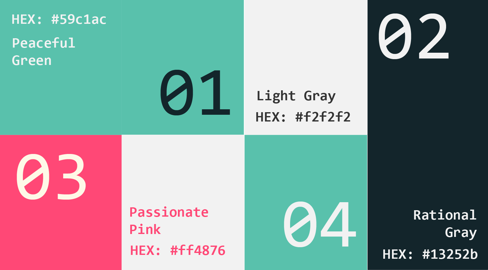
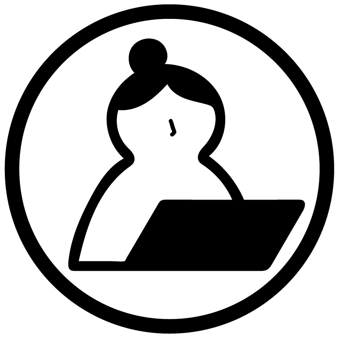
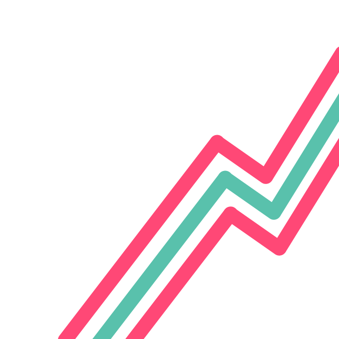
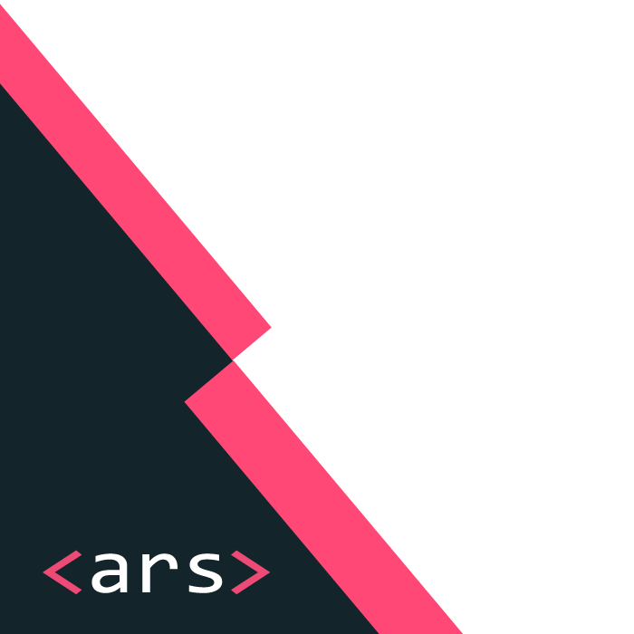

```{=html}
<script>
document.body.classList.add('branding-page');
</script>
```

::: {.custom-sidebar}
::: {.sidebar-logo}

:::

::: {.sidebar-nav}
[Home](index.qmd)
[About](about.qmd)
[Subscribe](subscribe.qmd)
[Branding](branding.qmd)
:::

::: {.sidebar-social}
[LinkedIn](https://linkedin.com/in/yourprofile){target="_blank"}
[GitHub](https://github.com/yourusername){target="_blank"}
:::
:::

::: {.main-content-wrapper}
::: {.hero-banner}

:::

::: {.branding-content}
## 📝 Brand Statement {.section-title}

::: {.text-body}

**ARS** comes from Latin, meaning skills, methods, and science. It captures the multiple facets that make up of Data Science.

We aim to make data science and technologies approachable, engaging, transparent, and human-centered. By sharing content from technical programming to storytelling with data, we want to engage with audiance from various stage of the journey, showcase the power of data, and discuss the ethics of harvesting this power.

We emphasize that data science is not just for experts but a creative tool anyone can explore and enjoy. It also shapes the future of communication, learning, and everyday life.
:::

## 🎨 Color Palette {.section-title}

::: {.one-column}



:::

## 🪜 The Design Process {.section-title}

::: {.three-column}
::: {.content-block}

### Understand the Brand {.text-h3}

::: {.text-body}
*Ars* aim to make data science and technologies approachable, engaging, transparent, and human-centered through informational blogs and fun projects. 

We want to convey both the professionalism that is associated with technology and data, as well as the creative and fun aspect of them.

Additionally, We value clarity and simplicity in our content, as well as the passion and excitement associate with hands-on learning. 

:::
:::

::: {.content-block}
### Define User Needs {.text-h3}

::: {.text-body}
*Ars* would attract users who are interested in learning more about in data science and looking for creative ideas to test the water in data science or flush up their resume.

User would like to see an organized blogs web interface, along with an "about" and "subscribe" session which help the user learn more about us and keep updated.
:::
:::

::: {.content-block}
### Build and Prototype {.text-h3}

::: {.text-body}
I created a main page with an organized blogs section on the right. Blogs are seperated according to featured blog and past blogs. A search button on the top right (TODO: FIX the location) enable search across all blogs and contents. I also built a left sidebar with links to "about" and "subscribe", as well as other social media outlets, allows quick access. 

For color schemes, I used cold neutral colors such as **black and grays** to convey the professionalism, clarity and simplicity. Then, I added **bright green and pink** to convey the passion, excitement, creativity, and fun. 

For texts, I used different styles and sizes of **Consolas**, as it is a monospaced text face that's commonly used in programming and its round edges conveys a sense of playfulness.

:::
:::
:::

::: {.two-column}
::: {.content-block}
# 🅰️ Typography {.text-h1}

::: {.text-body}
| **Element** | **Font** | **Font‑Size** | **Colour** | **Style**|
|------------|------------|------------|------------|------------|
| **Title** | Consolas | 1.8rem | #2c3e50 | Bold |
| **Heading (h1)** | Consolas | 1.5rem | #2c3e50 | Bold |
| **Subheading (h2)** | Consolas | 1.2rem | #34495e | Bold |
| **Subheading (h3)** | Consolas | 1rem | #34495e | Bold |
| **Paragraph** | Consolas | 0.85rem | #34495e | Vary | 
| **caption** | Consolas | 0.6rem | #34495e | Italics | 
| **Links** | Consolas | - | #3498db when hover | vary |

:::
:::
::: {.content-block}
# Typegraphy Sample Usage (h1) {.text-h1}
## Section Heading (h2) {.text-h2}
### Subsubction Heading (h3) {.text-h3}

::: {.text-body}
This is what body text looks like. Our primary typeface is Consolas, a monospaced font that provides a technical, modern feel while maintaining excellent readability across all devices and screen sizes.
:::

::: {.text-caption}
This is caption text - use it for image captions, footnotes, or supplementary information that supports the main content.
:::

:::
:::

::: {.horizontal-card}



::: {.text-content}
## 🗣️ We speak with: {.text-h2}

::: {.text-body}
-   Clearity & Creativity

-   Playfulness & Professionalism

-   Confidence & Humility
:::

:::
:::

::: {.horizontal-card .reverse}
::: {.image-block}

:::

::: {.text-content}
## We speak with: {.text-h2}

::: {.text-body}
-   Clearity & Creativity

-   Playfulness & Professionalism

-   Confidence & Humility
:::

:::
:::


:::
::: {.horizontal-card}
::: {.image-block style="text-align:left !important; justify-content:flex-start !important; margin-left:0 !important;"}

:::

::: {.text-content style = "margin-left:3rem !important;"}
## We speak with: {.text-h2}

::: {.text-body style = "margin-left:3rem !important;"}
-   Clearity & Creativity

-   Playfulness & Professionalism

-   Confidence & Humility
:::
:::
:::
:::
