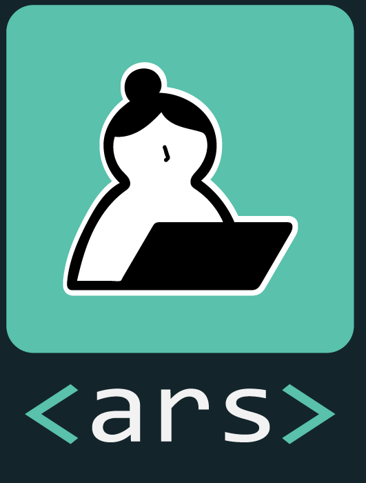

```{=html}
<script>
document.body.classList.add('subscribe-page');
</script>
```

::: {.custom-sidebar}
::: {.sidebar-logo}

:::

::: {.sidebar-nav}
[Home](index.qmd)
[About](about.qmd)
[Subscribe](subscribe.qmd)
[Branding](branding.qmd)
:::

::: {.sidebar-social}
[LinkedIn](https://www.linkedin.com/in/jx-chen/){target="_blank"}
[GitHub](https://github.com/Cpril){target="_blank"}
:::
:::

::: {.main-content-wrapper}


::: {.branding-content}


## Join ARS Community {.section-title}


::: {.text-body}

Join hundreds of data enthusiasts who receive our weekly newsletter. No spam, just quality content to help you grow your data science skills.

:::

### What Our Subscribers Say {.section-title}

::: {.three-column}
::: {.content-block}
::: {.text-body}
*"ARS newsletters are the highlight of my week. The tutorials are clear, the projects are fun, and I've learned so much!"*

**— Sarah M., Data Analyst**
:::
:::

::: {.content-block}
::: {.text-body}
*"Finally, a data science newsletter that's both technical and approachable. The project ideas have been invaluable for my portfolio."*

**— James K., Student**
:::
:::

::: {.content-block}
::: {.text-body}
*"I love how ARS balances technical depth with creativity. It's helped me see data science as more than just numbers."*

**— Maria L., Student**
:::
:::
:::

::: {.subscribe-form-section}
```{=html}
<div class="subscribe-form-container">
  <form class="subscribe-form" action="https://your-email-service.com/subscribe" method="POST">
    <div class="form-group">
      <label for="name">Name</label>
      <input type="text" id="name" name="name" placeholder="Your name" required>
    </div>
    
    <div class="form-group">
      <label for="email">Email Address</label>
      <input type="email" id="email" name="email" placeholder="your.email@example.com" required>
    </div>
    
    <div class="form-group checkbox-group">
      <input type="checkbox" id="interests-tutorials" name="interests" value="tutorials">
      <label for="interests-tutorials">Technical Tutorials</label>
    </div>
    
    <div class="form-group checkbox-group">
      <input type="checkbox" id="interests-projects" name="interests" value="projects">
      <label for="interests-projects">Creative Projects</label>
    </div>
    
    <div class="form-group checkbox-group">
      <input type="checkbox" id="interests-news" name="interests" value="news">
      <label for="interests-news">Industry News</label>
    </div>
    
    <button type="submit" class="submit-button">Subscribe Now</button>
  </form>
  
  <p class="privacy-note">We respect your privacy. Your email will never be shared with third parties. You can unsubscribe at any time.</p>
</div>
```
:::


## Follow Us on Social Media {.section-title}

::: {.text-body}
Can't wait for the weekly newsletter? Connect with us on social media for daily tips, quick tutorials, and community discussions.
:::

::: {.horizontal-card .reverse}

::: {.text-content}

::: {.text-body}

[**LinkedIn**](https://linkedin.com/in/jiaxin-chen){target="_blank"}: Professional insights and career tips

[**GitHub**](https://github.com/Cpril){target="_blank"}: Access our open-source projects and code

[**Instagram**](https://instagram){target="_blank"}: data science quick tips and news

:::
:::
:::

## Frequently Asked Questions {.section-title}


::: {.text-body}
**How often will I receive emails?**

We send one main newsletter per week. Occasionally, we may send special announcements for new courses or major updates.
:::

::: {.text-body}
**Can I choose what content I receive?**


Yes! When you subscribe, you can select your interests (tutorials, projects, or news). You can update your preferences at any time through your subscription settings.
:::


::: {.text-body}

**Is it really free?**

Absolutely! Our newsletter is completely free. We believe in making data science education accessible to everyone.
:::


::: {.text-body}
**How do I unsubscribe?**

Every email includes an unsubscribe link at the bottom. Click it anytime, and you'll be removed from our list immediately—no questions asked.
:::
:::


:::